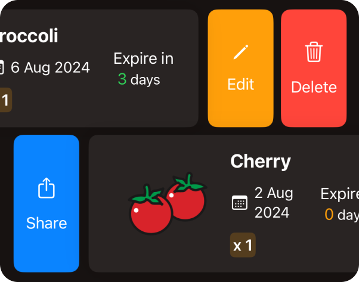

# SwipeTammie



**SwipeTammie** is a SwiftUI package that enables you to add customizable swipe actions to any view. This package provides a simple and flexible way to implement swipeable actions on both left and right swipe directions.

### 🚀 Features

- Customizable actions for left and right swipes
- Support for multiple actions
- Easy integration with SwiftUI
- Configurable appearance and behavior
- Lightweight, no dependencies

## ⛓️ Installation
### Swift Package Manager
To add `SwipeTammie` to your Xcode project using Swift Package Manager, follow these steps:
1. Open your project in Xcode.
2. Go to `File` > `Add Packages...`.
3. Enter the URL of the `SwipeTammie` repository:<br>
https://github.com/bii-08/SwipeTammie.git
4. Select the package and click Add Package.

## Usage
 ### Importing the Package
 First, import the `SwipeTammie` package in your SwiftUI view:
 ```swift
 import SwipeTammie
 ```
### Using SwipeTammie
```swift
import SwiftUI
import SwipeTammie

struct ContentView: View {
  @State private var items = ["View 1", "View 2", "View 3"]
  
    var body: some View {
       ScrollView {
           ForEach(items.indices, id:\.self) { index in
               SwipeTammie(content: {
                  Text(items[index])
                     .foregroundColor(.black)
                     .frame(maxWidth: .infinity, maxHeight: .infinity)
                     .background(Color.blue.opacity(0.5))
                     .cornerRadius(10)
               }, leftActions: [
                      Action(title: "Share", icon: "square.and.arrow.up", bgColor: .blue, fgColor: .white, cornerRadius: 10, action: { /* Share action */ })
               ], rightActions: [
                      Action(title: "Edit", icon: "pencil", bgColor: .orange, fgColor: .white, cornerRadius: 10, action: { /* Edit action */ }),
                      Action(title: "Delete", icon: "trash", bgColor: .red, fgColor: .white, cornerRadius: 10, action: { /* Delete action */ })
              ], frameHeight: 100)
            }
        }
    }
 }
```
### Customization
You can customize the appearance and behavior of the swipe actions by modifying the `Action` struct parameters and the `SwipeTammie` initialization parameters.

## Credit 
SwipeTammie is created by [Tam Luu](https://github.com/bii-08).

## Contributing
Contributions are welcome! If you find any issues or have suggestions for improvements, please open an issue or create a pull request.

## License
SwipeTammie is released under the MIT License. See the LICENSE file for more information.
```
MIT License

Copyright (c) 2024 Tam Luu

Permission is hereby granted, free of charge, to any person obtaining a copy
of this software and associated documentation files (the "Software"), to deal
in the Software without restriction, including without limitation the rights
to use, copy, modify, merge, publish, distribute, sublicense, and/or sell
copies of the Software, and to permit persons to whom the Software is
furnished to do so, subject to the following conditions:

The above copyright notice and this permission notice shall be included in all
copies or substantial portions of the Software.

THE SOFTWARE IS PROVIDED "AS IS", WITHOUT WARRANTY OF ANY KIND, EXPRESS OR
IMPLIED, INCLUDING BUT NOT LIMITED TO THE WARRANTIES OF MERCHANTABILITY,
FITNESS FOR A PARTICULAR PURPOSE AND NONINFRINGEMENT. IN NO EVENT SHALL THE
AUTHORS OR COPYRIGHT HOLDERS BE LIABLE FOR ANY CLAIM, DAMAGES OR OTHER
LIABILITY, WHETHER IN AN ACTION OF CONTRACT, TORT OR OTHERWISE, ARISING FROM,
OUT OF OR IN CONNECTION WITH THE SOFTWARE OR THE USE OR OTHER DEALINGS IN THE
SOFTWARE.
```

